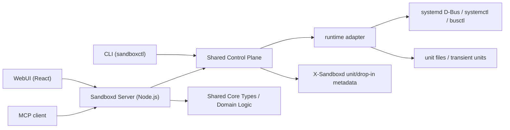
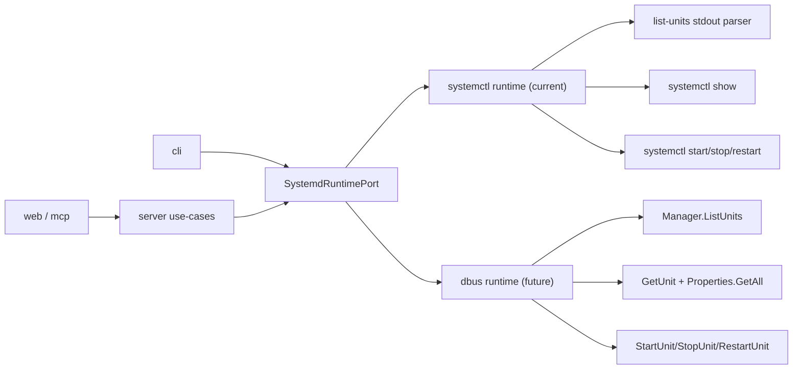

# Sandboxd

Sandboxd 是一个面向 agent 时代的 homelab sandbox manager。它的目标不是复刻一套新的编排系统，而是把 systemd 当作唯一的宿主控制平面：所有受管对象最终都落到 systemd unit，WebUI、CLI 与 MCP 只是同一控制面的不同入口。

它在产品定位上接近 Portainer / Proxmox 这类“单机控制台”，但实现原则完全不同：Sandboxd 不试图隐藏宿主机，而是直接拥抱 systemd、cgroup v2、unit file、D-Bus 与 systemd 自带的沙箱/资源控制能力。

如果你是继续在这个仓库中协作的 agent，先看 [AGENT.md](/Users/timzhong/systemd-homelab/AGENT.md)；那里记录了当前阶段的目标、边界和默认推进顺序。

TypeScript 编码规范见 [docs/typescript-style.md](/Users/timzhong/systemd-homelab/docs/typescript-style.md)。这个仓库明确偏好精确类型、显式收窄和窄接口设计，不接受“宽 base type + 内部 switch 分发一切”的默认写法。

## 项目定位

Sandboxd 解决的是单机 homelab 场景下的“把杂乱的 service、sandbox、container、VM 统一纳入一个可读可控的界面”问题。

核心目标：

- 提供一个能预览宿主机全部 systemd units 的 WebUI。
- 在同一视图中标记哪些是系统自带 unit，哪些是 Sandboxd 创建的对象。
- 为未来的 container / VM 提前定义统一的对象模型与展示方式。
- 让 agent 可以通过 MCP 在同一语义层上发现、检查和操控对象，而不是到处 shell。

核心差异：

- 相比 Portainer，Sandboxd 不以 OCI 容器为中心，而以 systemd unit 为中心。
- 相比 Proxmox，Sandboxd 不先做完整虚拟化平台，而是先做宿主机控制面和 sandbox 抽象。
- 相比通用 PaaS，它不追求多租户、集群、RBAC 或企业审计，而追求单人可控、系统语义清晰、能与宿主机长期共存。

## 设计原则

1. 所有受管对象最终都映射为 systemd unit，不另建自定义运行时。
2. WebUI 的“容器 / 虚拟机 / 项目托管 unit”只是同一 unit 模型上的分类与增强展示。
3. V1 先把 unit inventory 和项目托管 sandboxed service 做稳，container / VM 只做接入设计，不做实现承诺。

这意味着 Sandboxd 的第一个里程碑不是“能跑更多东西”，而是“把宿主机现有对象和项目管理对象放进同一套准确的视图与操作模型里”。

## V1 范围与非目标

### V1 范围

- 读取系统级 systemd manager 中的全部 units，并在 WebUI 展示。
- 定义并展示统一的 `ManagedEntity` 视图。
- 创建和管理由 Sandboxd 托管的普通 sandboxed service。
- 对 Sandboxd 托管对象附加基础资源控制与安全沙箱配置。
- 通过 WebUI、CLI、MCP 暴露一致的动作语义：`list`、`inspect`、`start`、`stop`、`restart`、`create sandboxed service`。

### V1 非目标

- 多用户、RBAC、SSO、审计日志。
- 多机管理、集群、调度器、高可用。
- 完整容器平台、镜像仓库编排、Kubernetes 兼容。
- 完整虚拟化平台、高级网络/存储编排。
- 数据库优先的控制面设计。

### V1 当前状态

- V1 所需的控制面逻辑已经快速实现完成：WebUI、CLI、MCP、HTTP API 和 shared control-plane 都已闭环。
- 当前状态应理解为“逻辑实现完成”，不是“实机验证完成”。
- 目前仍缺少在真实宿主机 systemd 环境上的系统性实机验证，尤其是创建、dangerous adopt、drop-in ownership 标记和真实权限边界。

### 运行假设

- 目标平台是启用 unified cgroup v2 的现代 Linux systemd 主机。
- 默认信任边界是单机、单管理员。
- 首版优先面向 system manager，而不是 user manager。

## 核心实体模型

Sandboxd 仍然围绕统一的 `ManagedEntity` 语义工作，但 V1 的接口契约已经拆成 3 组，而不是继续用一个过胖的对象同时承载列表、详情和创建入参。

```ts
export type ManagedEntityKind = "systemd-unit" | "sandbox-service" | "container" | "vm";

export type ManagedEntityOrigin = "external" | "sandboxd";

export interface ManagedEntitySummary {
  kind: ManagedEntityKind;
  origin: ManagedEntityOrigin;
  unitName: string;
  unitType: string;
  state: string;
  subState?: string;
  loadState?: string;
  slice?: string;
  description?: string;
  sandboxProfile?: string;
  labels: Record<string, string>;
  capabilities: {
    canInspect: boolean;
    canStart: boolean;
    canStop: boolean;
    canRestart: boolean;
  };
}

export interface ManagedEntityDetail extends ManagedEntitySummary {
  resourceControls: {
    cpuWeight?: string;
    memoryMax?: string;
    tasksMax?: string;
  };
  sandboxing: {
    noNewPrivileges?: boolean;
    privateTmp?: boolean;
    protectSystem?: string;
    protectHome?: boolean;
  };
  status: {
    activeState: string;
    subState: string;
    loadState: string;
  };
}

export interface CreateSandboxServiceInput {
  name: string;
  execStart: string;
  description?: string;
  workingDirectory?: string;
  environment?: Record<string, string>;
  slice?: string;
  sandboxProfile?: string;
  resourceControls?: {
    cpuWeight?: string;
    memoryMax?: string;
    tasksMax?: string;
  };
  sandboxing?: {
    noNewPrivileges?: boolean;
    privateTmp?: boolean;
    protectSystem?: string;
    protectHome?: boolean;
  };
}
```

字段约定：

- `ManagedEntitySummary` 用于列表页、概览卡片、批量刷新。
- `ManagedEntityDetail` 用于详情页、动作返回值、创建成功后的对象快照。
- `CreateSandboxServiceInput` 用于 WebUI、CLI、MCP 统一的创建入参。
- `capabilities` 是前端动作可用性的来源，不让 WebUI 自己重新推断。
- `resourceControls` 和 `sandboxing` 是 V1 详情接口必须稳定返回的配置面。

分类规则：

| 类别              | systemd 背书                     | V1 状态 | WebUI 表现                                            |
| ----------------- | -------------------------------- | ------- | ----------------------------------------------------- |
| `systemd-unit`    | 宿主机已有 unit                  | 已实现  | 普通 unit，显示 `external` 或 `sandboxd-managed` 标签 |
| `sandbox-service` | `service` + 专用 `slice`         | 已实现  | 特殊高亮，显示资源与沙箱信息                          |
| `container`       | 未来映射到 unit-backed container | 预留    | 特殊图标和分类                                        |
| `vm`              | 未来映射到 wrapped QEMU unit     | 预留    | 特殊图标和分类                                        |

项目托管对象的生命周期仍以 systemd 为准。Sandboxd 负责的是发现、命名、元数据、展示和操作入口，而不是自己维护一套平行状态机。

## 技术架构

Sandboxd 在启动阶段锁定为 TypeScript full stack，但从第一天就把高层控制面与低层运行时适配分开。



### 组件划分

- `server`：Node.js 进程入口与 transport host，承载 HTTP API 和 `/mcp`。
- `core`：共享类型、领域模型、标签规则、对象映射逻辑。
- `control-plane`：共享 ports、adapters、use-cases 和装配函数。
- `web`：React WebUI，优先解决 unit inventory 与对象分类展示。
- `cli`：`sandboxctl`，在本机直接依赖 shared control-plane 管理 sandbox。
- `mcp`：MCP tool/server 定义，由 `server` 通过 `/mcp` 挂载为无状态 MCP HTTP endpoint。
- `runtime-systemd`：低层适配层，负责 D-Bus、`systemctl`、`busctl`、unit 文件与 transient units 的交互。

### 为什么是 TypeScript full stack

- V1 的核心难点是“统一控制面”和“统一对象模型”，不是极限性能。
- WebUI、CLI、MCP、domain types 共享一套 TypeScript 类型，能显著降低空仓库起步成本。
- 低层 systemd 交互被压在 `runtime adapter` 边界后，后续即使引入 Rust helper，也不必推翻上层 API 和 UI 模型。

### TypeScript 约束

- 默认优先精确领域类型，而不是宽泛 base interface。
- 默认优先 assertion function / type guard 做显式收窄，再调用具体逻辑。
- 非常通用的共享字段才允许上提到公共类型；否则保留在具体类型上。
- 不要设计“一个抽象入参 + 大段 switch case”来承载不相干行为。
- 更多细则见 [docs/typescript-style.md](/Users/timzhong/systemd-homelab/docs/typescript-style.md)。

### systemd 绑定策略

- 持久化对象优先使用真实 unit file。
- 瞬时对象未来如有需要可使用 transient unit，但这应保持为实现细节。
- 项目托管对象的 ownership 元数据优先贴在 systemd unit / drop-in 中的 `X-Sandboxd` 段。
- unit 的真实状态、依赖关系、启动顺序和故障语义一律以 systemd 为源。

V1 不把 `scope` 暴露成用户可直接操作的对象类型。`scope` 通常不是用户直接使用的持久化管理单元，也不一定长期存在；如果后续内部实现需要借助它，也应该保持对用户透明。

V1 不承诺数据库，也不承诺自定义 agent runtime。所有复杂度都优先压进 systemd 原语和少量附加元数据。

### runtime-systemd 演进策略

当前 runtime adapter 仍然允许使用 `systemctl`，但长期方向不是继续围绕 stdout 文本做复杂解析，而是把读路径逐步迁到更结构化的 systemd 接口。

默认演进路径：

1. 稳定 `SystemdRuntimePort`
2. 保持上层 use-case / transport 不感知底层实现
3. 短期用 `systemctl`
4. 中期做 D-Bus adapter spike
5. 验证稳定后再切换默认读路径

建议中的 runtime 分层：



当前默认策略：

- `list` 可以暂时继续使用 `systemctl list-units`
- `inspect` 应优先往 `systemctl show` 的结构化属性读取收敛
- `start` / `stop` / `restart` 可以继续通过 `systemctl` 执行
- 不要继续扩大“整行 stdout 正则解析”承担的职责范围

关于 `dbus-next`：

- 可以作为 Node 侧 D-Bus adapter 的候选实现
- 现阶段不把“迁移到 dbus-next”本身当作里程碑
- 优先迁移的是 runtime 边界，而不是先绑定到某个具体库

推荐的实施顺序：

1. 先让 `systemctl` adapter 内部稳定产出统一的 `SystemdUnitRecord` / `SystemdUnitDetailRecord`
2. 再增加一个并行的 D-Bus adapter，只先覆盖 `getUnit()`
3. D-Bus 详情读取稳定后，再扩到 `listUnits()`
4. 最后再评估是否把动作接口也切到 D-Bus method call

这个顺序的目标是降低风险：先用 D-Bus 解决最适合结构化读取的 `inspect`，而不是一开始就全面替换现有 runtime。

### 当前代码分层

为了降低技术债并提高 AI 并行开发效率，当前代码默认按以下方向拆分：

- `packages/core`：领域模型、纯映射、纯解析、纯校验
- `packages/control-plane`：ports、systemd runtime、metadata adapters、服务端业务编排
- `apps/server/src/transport/http`：HTTP transport
- `apps/cli/src`：CLI 参数解析、文本输出、本地 control-plane 装配
- `apps/mcp/src`：MCP tool 定义和 server 构造
- `apps/web/src/ports`：前端 use-case 依赖的 client 接口
- `apps/web/src/transport/http`：API 请求与 payload 解析
- `apps/web/src/use-cases`：前端业务动作编排
- `apps/web/src/view-model`：React 状态组织
- `apps/web/src/ui`：纯渲染组件

默认依赖方向是：

- `core` 不依赖 `server` / `web`
- `control-plane` 依赖 `core`
- `server transport` 依赖 `control-plane`，不直接拼业务逻辑
- `cli` 直接依赖 `control-plane`

这套约束的目的不是追求“层数更多”，而是把 agent 高频改动拆散，避免多个任务总是集中编辑同一个文件。

## 控制面

三种入口共享同一套动作语义与同一实体模型。

### WebUI

首版 WebUI 聚焦 inventory 和最小写操作：

- 列出全部 systemd units。
- 按 `external` / `sandboxd-managed` / 未来 `container` / `vm` 分类展示。
- 查看 unit 基本状态、类型、slice、沙箱配置、资源限制。
- 对 Sandboxd 托管对象执行 `start`、`stop`、`restart`。
- 创建一个新的 sandboxed service。

当前 WebUI 的 hover 高亮遵循统一的“设备外壳”语言：

- 对于带“电源按钮 / 状态灯”语义的卡片：
  - 未选中时保持最低亮度
  - hover 时以电源按钮自身的中等亮度发光为主
  - 选中后进一步提亮到最高亮度，并出现局部漏光效果
- 对于没有电源按钮的配置容器：
  - 以轻整圈描边为基底
  - 再用两个对角的局部渐变增强作为主要发光重心
  - 亮度高于普通边框，但不做漏光
- 避免整圈平均发亮，减少普通表单 hover 的既视感

### CLI

CLI 暂定命令名为 `sandboxctl`，示意语义如下：

```bash
sandboxctl list
sandboxctl inspect nginx.service
sandboxctl start my-lab.service
sandboxctl stop my-lab.service
sandboxctl restart my-lab.service
sandboxctl dangerous-adopt docker.service --profile baseline
sandboxctl create sandboxed-service my-lab --cpu-weight 200 --memory-max 512M --profile strict
```

CLI 的目标不是包一层与 systemctl 冲突的方言，而是暴露 Sandboxd 自己的对象模型和托管语义。

当前实现：

- 本机直接依赖 shared control-plane，不需要先启动 `server`
- 所有命令支持 `--json`
- 创建、读写动作都直接走本地 runtime / metadata adapter
- 额外提供 `dangerous-adopt`，可把已有 systemd service 标记为 sandboxd owned

### MCP

MCP 的职责是让 agent 在“受管对象”这个抽象层上工作，而不是直接拼接 shell 命令。首版工具语义与 CLI 一致：

- `list`
- `inspect`
- `start`
- `stop`
- `restart`
- `create_sandboxed_service`

当前实现：

- server 通过 `POST /mcp` 暴露无状态 MCP HTTP endpoint
- MCP tool 定义在独立的 `apps/mcp` workspace
- MCP 直接复用 shared control-plane，不走本地 HTTP 回环
- 额外暴露危险工具，把已有 systemd service 标记为 sandboxd owned

未来如果扩展 container / VM，MCP 也复用同一 `ManagedEntity` 模型，而不是新增一套旁路工具。

### HTTP API

V1 统一对外 HTTP 接口约定如下：

```http
GET  /api/entities
GET  /api/entities/:unitName
POST /api/entities/:unitName/start
POST /api/entities/:unitName/stop
POST /api/entities/:unitName/restart
POST /api/entities/:unitName/dangerous-adopt
POST /api/sandbox-services
POST /mcp
```

返回约定：

- `GET /api/entities` 返回 `ManagedEntitySummary[]`
- `GET /api/entities/:unitName` 返回 `ManagedEntityDetail`
- 三个动作接口返回动作后的 `ManagedEntityDetail`
- `POST /api/entities/:unitName/dangerous-adopt` 接收危险认领入参并返回动作后的 `ManagedEntityDetail`
- `POST /api/sandbox-services` 接收 `CreateSandboxServiceInput` 并返回新建对象的 `ManagedEntityDetail`

### 典型场景

场景一：浏览宿主机全部 unit

- 用户打开 WebUI 后，先看到系统级 unit inventory。
- `docker.service`、`NetworkManager.service` 这类对象显示为 `external`。
- 由 Sandboxd 创建的 `lab-redis.service` 显示为 `sandboxd-managed`，并突出显示资源限制与沙箱配置。

场景二：创建一个受限 service

- 用户通过 CLI 或 WebUI 创建一个新的项目托管 service。
- 该对象最终以 `service` 形式存在，并挂到专用 `slice` 下。
- 常见 V1 约束包括 `CPUWeight=`、`MemoryMax=`、`NoNewPrivileges=`、`PrivateTmp=`、`ProtectSystem=` 等。

场景三：未来 container / VM 的展示方式

- 一个由 `systemd-nspawn` 驱动的容器，未来在 UI 中显示为 `kind=container`。
- 一个由 `qemu-system-*` wrapped unit 托管的虚拟机，未来在 UI 中显示为 `kind=vm`。
- 它们在 UI 上有特殊标记，但底层仍然是 unit-backed objects，仍然遵守同一发现、状态与控制语义。

## 路线图

### Phase 1: Unit Inventory

- 构建只读 unit explorer。
- 拉通 `ManagedEntity` 视图。
- 实现 `external` 与 `sandboxd-managed` 分类。
- 打通 WebUI / CLI / MCP 的基础读取能力。

### Phase 2: Sandboxed Service

- 支持创建、更新、删除项目托管的 `service`。
- 支持基础资源控制：CPU、内存、slice 归属。
- 支持基础安全沙箱：文件系统隔离、权限收缩、临时目录隔离。
- 增加“高级模式”，以结构化交互方式暴露第一批原生 systemd sandbox 属性，而不是直接退化成 ini 编辑器。
- 在 WebUI 中展示 profile 与实际 unit 配置的映射关系。

第二阶段的高级模式当前先收敛一条约束：只支持一批高价值、可校验、可解释、可做表单交互的原生属性。首批清单已经在 `packages/core` 注册表里固化，包括：

- `ProtectSystem`
- `ProtectHome`
- `PrivateTmp`
- `ReadOnlyPaths`
- `ReadWritePaths`
- `InaccessiblePaths`
- `NoNewPrivileges`
- `CapabilityBoundingSet`
- `PrivateDevices`
- `PrivateUsers`
- `PrivateNetwork`
- `RestrictNamespaces`
- `SystemCallFilter`
- `RestrictAddressFamilies`
- `CPUWeight`
- `MemoryMax`
- `TasksMax`
- `WorkingDirectory`
- `Environment`

这批基础设施当前已经落地到代码中，作为后续 V2 推进的固定起点：

- 单属性 grammar parsing 已收敛到 `packages/core` 的共享 parser registry
- parser 采用 zod transform，把单条 directive value 从 `string` 解析成结构化值
- 标量属性使用 `{ parsed?, raw? }`
- 可重复属性使用 `Array<{ parsed?, raw? }>`
- `Environment=` 采用 parsed/raw 双态，能结构化就给 `parsed`，不能安全结构化就保留 `raw`
- sibling-level 的组合校验、冲突检测和 warning 继续留在 parser 之外，由后续 validation 层统一处理

未知属性兜底策略也同时固定：

- 已支持属性走结构化字段 `advancedProperties`
- 未支持但在 unit / drop-in 中检测到的原生 `Service` 指令，保存在 `unknownSystemdDirectives`
- WebUI 后续应把这类字段标成“检测到但当前不支持结构化编辑”，而不是静默丢弃
- MCP 不直接内嵌整份 systemd 文档，而是按需提供属性目录和单项说明

基于这次重构，第二阶段后续默认按这个顺序推进：

1. 先补 object-level validation / warning，把 sibling-level 约束从 ad-hoc 逻辑收敛成可复用规则。
2. 再做 WebUI 高级模式表单，统一由 property registry 驱动控件、说明和默认展示分组。
3. 然后补 create / update 写路径，让第一批高级属性能稳定 round-trip 到 unit / drop-in。
4. 最后再考虑 profile、drift 展示和更大范围的高级属性扩展。

### Phase 3: Container and VM

- 以 `systemd-nspawn` 为首选路径接入 container。
- 以 `qemu-system-*` wrapped units 为首选路径接入 VM。
- 继续沿用 `ManagedEntity` 和统一控制面，不为 container / VM 重建第二套管理模型。

## 当前仓库状态

当前仓库已经初始化为一个 `pnpm` monorepo，并先落地 3 个包：

- `apps/web`：React + Vite 的 WebUI 骨架。
- `apps/server`：Node.js 控制面骨架，已经对齐 V1 HTTP 接口面。
- `packages/core`：共享实体模型、summary/detail 契约和 payload 校验。
- `packages/control-plane`：共享 ports、runtime adapters、metadata adapters、use-cases 和装配函数。
- `apps/cli`：`sandboxctl` CLI。
- `apps/mcp`：MCP server/tool 定义。

当前这批代码已经把 V1 的控制面落成 `core <- control-plane <- server/web/cli/mcp` 结构。

`apps/server` 现在会优先尝试读取真实 systemd unit inventory；如果运行环境不是 Linux，或者 `systemctl` 不可用 / 不可访问，则会自动退回 fixture inventory，保证本地开发、测试和 CI 仍然可运行。

## 本地开发

安装依赖：

```bash
pnpm install
```

一键启动服务端和 WebUI：

```bash
pnpm dev
```

启动服务端：

```bash
pnpm dev:server
```

启动 WebUI：

```bash
pnpm dev:web
```

质量命令：

```bash
pnpm exec playwright install chromium
pnpm verify:quick
pnpm smoke:dev
pnpm verify
pnpm test:e2e
pnpm build
pnpm typecheck
pnpm lint
pnpm format:check
pnpm test
```

其中：

- `pnpm verify:quick` 是 agent 日常迭代的快回路，会跑 `format:check`、`lint`、`typecheck`、`test`、`smoke:dev`
- `pnpm smoke:dev` 会直接拉起 server 和 web，检查 `/healthz`、`/api/entities` 和首页标题
- `pnpm verify` 是提交前的全量回路，会顺序执行 `format:check`、`lint`、`typecheck`、`test`、`test:e2e`、`build`
- CI 使用 GitHub Actions Ubuntu runner 预装的 Google Chrome，不再单独下载 Playwright Chromium

另外，运行时 payload 校验保留在 `@sandboxd/core`，而 fixture/fallback 场景归 `apps/server` 的 metadata adapter 管理，避免把测试数据污染到 domain 包。首次在本机运行 Playwright 前需要先安装一次 Chromium。

## 参考资料

中文参考：

- [金步国作品集 / 《Systemd 中文手册》](https://www.jinbuguo.com/)

官方资料：

- [org.freedesktop.systemd1](https://www.freedesktop.org/software/systemd/man/org.freedesktop.systemd1.html)
- [systemd.exec](https://www.freedesktop.org/software/systemd/man/latest/systemd.exec.html)
- [systemd.resource-control](https://www.freedesktop.org/software/systemd/man/latest/systemd.resource-control.html)
- [systemd-analyze](https://www.freedesktop.org/software/systemd/man/latest/systemd-analyze.html)
- [machinectl](https://www.freedesktop.org/software/systemd/man/latest/machinectl.html)
- [systemd-nspawn](https://www.freedesktop.org/software/systemd/man/latest/systemd-nspawn.html)

这些资料的用途不是让 Sandboxd 变成 systemd 的抽象屏障，而是反过来保证产品设计始终贴着 systemd 的真实能力前进。
