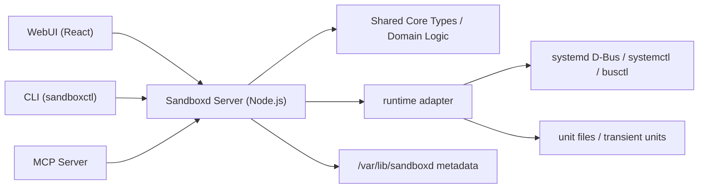

# Sandboxd

Sandboxd 是一个面向 agent 时代的 homelab sandbox manager。它的目标不是复刻一套新的编排系统，而是把 systemd 当作唯一的宿主控制平面：所有受管对象最终都落到 systemd unit，WebUI、CLI 与 MCP 只是同一控制面的不同入口。

它在产品定位上接近 Portainer / Proxmox 这类“单机控制台”，但实现原则完全不同：Sandboxd 不试图隐藏宿主机，而是直接拥抱 systemd、cgroup v2、unit file、D-Bus 与 systemd 自带的沙箱/资源控制能力。

如果你是继续在这个仓库中协作的 agent，先看 [AGENT.md](/Users/timzhong/systemd-homelab/AGENT.md)；那里记录了当前阶段的目标、边界和默认推进顺序。

## 项目定位

Sandboxd 解决的是单机 homelab 场景下的“把杂乱的 service、sandbox、container、VM 统一纳入一个可读可控的界面”问题。

核心目标：

- 提供一个能预览宿主机全部 systemd units 的 WebUI。
- 在同一视图中标记哪些是系统自带 unit，哪些是 Sandboxd 创建的对象。
- 为未来的 container / VM 提前定义统一的对象模型与展示方式。
- 让 agent 可以通过 MCP 在同一语义层上发现、检查和操控对象，而不是到处 shell。

核心差异：

- 相比 Portainer，Sandboxd 不以 OCI 容器为中心，而以 systemd unit 为中心。
- 相比 Proxmox，Sandboxd 不先做完整虚拟化平台，而是先做宿主机控制面和 sandbox 抽象。
- 相比通用 PaaS，它不追求多租户、集群、RBAC 或企业审计，而追求单人可控、系统语义清晰、能与宿主机长期共存。

## 设计原则

1. 所有受管对象最终都映射为 systemd unit，不另建自定义运行时。
2. WebUI 的“容器 / 虚拟机 / 项目托管 unit”只是同一 unit 模型上的分类与增强展示。
3. V1 先把 unit inventory 和项目托管 sandboxed service 做稳，container / VM 只做接入设计，不做实现承诺。

这意味着 Sandboxd 的第一个里程碑不是“能跑更多东西”，而是“把宿主机现有对象和项目管理对象放进同一套准确的视图与操作模型里”。

## V1 范围与非目标

### V1 范围

- 读取系统级 systemd manager 中的全部 units，并在 WebUI 展示。
- 定义并展示统一的 `ManagedEntity` 视图。
- 创建和管理由 Sandboxd 托管的普通 sandboxed service / scope。
- 对 Sandboxd 托管对象附加基础资源控制与安全沙箱配置。
- 通过 WebUI、CLI、MCP 暴露一致的动作语义：`list`、`inspect`、`start`、`stop`、`restart`、`create sandboxed service`。

### V1 非目标

- 多用户、RBAC、SSO、审计日志。
- 多机管理、集群、调度器、高可用。
- 完整容器平台、镜像仓库编排、Kubernetes 兼容。
- 完整虚拟化平台、高级网络/存储编排。
- 数据库优先的控制面设计。

### 运行假设

- 目标平台是启用 unified cgroup v2 的现代 Linux systemd 主机。
- 默认信任边界是单机、单管理员。
- 首版优先面向 system manager，而不是 user manager。

## 核心实体模型

Sandboxd 不把“unit、container、VM”拆成互不相干的三套对象，而是统一抽象为一个 `ManagedEntity`。

```ts
export type ManagedEntityKind = "systemd-unit" | "sandbox-service" | "container" | "vm";

export type ManagedEntityOrigin = "external" | "sandboxd";

export interface ManagedEntity {
  kind: ManagedEntityKind;
  origin: ManagedEntityOrigin;
  unitName: string;
  unitType: "service" | "scope" | "slice" | "socket" | "target" | "timer" | string;
  state: string;
  slice?: string;
  labels: Record<string, string>;
  sandboxProfile?: string;
}
```

字段约定：

- `kind`：对象类别。V1 实现 `systemd-unit` 与 `sandbox-service`，`container` / `vm` 作为保留枚举提前写入模型。
- `origin`：对象来源。`external` 表示系统已有 unit，`sandboxd` 表示由 Sandboxd 创建或接管展示元数据的对象。
- `unitName`：最终受 systemd 管理的 unit 名称。
- `unitType`：systemd 原生 unit 类型，避免在 UI 上把 systemd 语义抹平。
- `slice`：对象归属的 slice。V1 的项目托管对象默认落在专用 `slice` 中，例如 `sandboxd.slice` 或其子 slice。
- `labels`：Sandboxd 自己维护的展示和归类元数据。
- `sandboxProfile`：逻辑上的安全模板名，用于映射到具体 systemd sandbox / resource-control 选项。

分类规则：

| 类别              | systemd 背书                       | V1 状态 | WebUI 表现                                            |
| ----------------- | ---------------------------------- | ------- | ----------------------------------------------------- |
| `systemd-unit`    | 宿主机已有 unit                    | 已实现  | 普通 unit，显示 `external` 或 `sandboxd-managed` 标签 |
| `sandbox-service` | `service` / `scope` + 专用 `slice` | 已实现  | 特殊高亮，显示资源与沙箱信息                          |
| `container`       | 未来映射到 unit-backed container   | 预留    | 特殊图标和分类                                        |
| `vm`              | 未来映射到 wrapped QEMU unit       | 预留    | 特殊图标和分类                                        |

项目托管对象的生命周期仍以 systemd 为准。Sandboxd 负责的是发现、命名、元数据、展示和操作入口，而不是自己维护一套平行状态机。

## 技术架构

Sandboxd 在启动阶段锁定为 TypeScript full stack，但从第一天就把高层控制面与低层运行时适配分开。



### 组件划分

- `server`：Node.js 控制平面，承载统一 API 与权限边界。
- `core`：共享类型、领域模型、标签规则、对象映射逻辑。
- `web`：React WebUI，优先解决 unit inventory 与对象分类展示。
- `cli`：暂定命令名 `sandboxctl`，负责脚本化与终端操作。
- `mcp`：暴露给 agent 的工具接口，语义与 CLI 对齐。
- `runtime-systemd`：低层适配层，负责 D-Bus、`systemctl`、`busctl`、unit 文件与 transient units 的交互。

### 为什么是 TypeScript full stack

- V1 的核心难点是“统一控制面”和“统一对象模型”，不是极限性能。
- WebUI、CLI、MCP、domain types 共享一套 TypeScript 类型，能显著降低空仓库起步成本。
- 低层 systemd 交互被压在 `runtime adapter` 边界后，后续即使引入 Rust helper，也不必推翻上层 API 和 UI 模型。

### systemd 绑定策略

- 持久化对象优先使用真实 unit file。
- 瞬时对象可使用 transient unit / scope。
- 项目托管对象的元数据采用 filesystem-first，保存在 `/var/lib/sandboxd/`。
- unit 的真实状态、依赖关系、启动顺序和故障语义一律以 systemd 为源。

V1 不承诺数据库，也不承诺自定义 agent runtime。所有复杂度都优先压进 systemd 原语和少量附加元数据。

## 控制面

三种入口共享同一套动作语义与同一实体模型。

### WebUI

首版 WebUI 聚焦只读 inventory 和最小写操作：

- 列出全部 systemd units。
- 按 `external` / `sandboxd-managed` / 未来 `container` / `vm` 分类展示。
- 查看 unit 基本状态、类型、slice、沙箱配置、资源限制。
- 对 Sandboxd 托管对象执行 `start`、`stop`、`restart`。
- 创建一个新的 sandboxed service。

### CLI

CLI 暂定命令名为 `sandboxctl`，示意语义如下：

```bash
sandboxctl list
sandboxctl inspect nginx.service
sandboxctl start my-lab.service
sandboxctl stop my-lab.service
sandboxctl restart my-lab.service
sandboxctl create sandboxed-service my-lab --cpu-weight 200 --memory-max 512M --profile strict
```

CLI 的目标不是包一层与 systemctl 冲突的方言，而是暴露 Sandboxd 自己的对象模型和托管语义。

### MCP

MCP 的职责是让 agent 在“受管对象”这个抽象层上工作，而不是直接拼接 shell 命令。首版工具语义与 CLI 一致：

- `list`
- `inspect`
- `start`
- `stop`
- `restart`
- `create_sandboxed_service`

未来如果扩展 container / VM，MCP 也复用同一 `ManagedEntity` 模型，而不是新增一套旁路工具。

### 典型场景

场景一：浏览宿主机全部 unit

- 用户打开 WebUI 后，先看到系统级 unit inventory。
- `docker.service`、`NetworkManager.service` 这类对象显示为 `external`。
- 由 Sandboxd 创建的 `lab-redis.service` 显示为 `sandboxd-managed`，并突出显示资源限制与沙箱配置。

场景二：创建一个受限 service

- 用户通过 CLI 或 WebUI 创建一个新的项目托管 service。
- 该对象最终以 `service` 或 `scope` 形式存在，并挂到专用 `slice` 下。
- 常见 V1 约束包括 `CPUWeight=`、`MemoryMax=`、`NoNewPrivileges=`、`PrivateTmp=`、`ProtectSystem=` 等。

场景三：未来 container / VM 的展示方式

- 一个由 `systemd-nspawn` 驱动的容器，未来在 UI 中显示为 `kind=container`。
- 一个由 `qemu-system-*` wrapped unit 托管的虚拟机，未来在 UI 中显示为 `kind=vm`。
- 它们在 UI 上有特殊标记，但底层仍然是 unit-backed objects，仍然遵守同一发现、状态与控制语义。

## 路线图

### Phase 1: Unit Inventory

- 构建只读 unit explorer。
- 拉通 `ManagedEntity` 视图。
- 实现 `external` 与 `sandboxd-managed` 分类。
- 打通 WebUI / CLI / MCP 的基础读取能力。

### Phase 2: Sandboxed Service

- 支持创建、更新、删除项目托管的 `service` / `scope`。
- 支持基础资源控制：CPU、内存、slice 归属。
- 支持基础安全沙箱：文件系统隔离、权限收缩、临时目录隔离。
- 在 WebUI 中展示 profile 与实际 unit 配置的映射关系。

### Phase 3: Container and VM

- 以 `systemd-nspawn` 为首选路径接入 container。
- 以 `qemu-system-*` wrapped units 为首选路径接入 VM。
- 继续沿用 `ManagedEntity` 和统一控制面，不为 container / VM 重建第二套管理模型。

## 当前仓库状态

当前仓库已经初始化为一个 `pnpm` monorepo，并先落地 3 个包：

- `apps/web`：React + Vite 的 WebUI 骨架。
- `apps/server`：Node.js 控制面骨架，提供健康检查和示例实体接口。
- `packages/core`：共享实体模型和基础领域工具。

暂未创建独立包，但已在架构上保留的位置：

- `cli`
- `mcp`
- `runtime-systemd`

当前这批骨架代码的目的不是实现完整功能，而是先打通 `web <- server <- core` 的类型与运行链路，让后续迭代能够直接围绕真实工作区展开。

## 本地开发

安装依赖：

```bash
pnpm install
```

启动服务端：

```bash
pnpm dev:server
```

启动 WebUI：

```bash
pnpm dev:web
```

质量命令：

```bash
pnpm build
pnpm typecheck
pnpm lint
pnpm format:check
pnpm test
```

## 参考资料

中文参考：

- [金步国作品集 / 《Systemd 中文手册》](https://www.jinbuguo.com/)

官方资料：

- [org.freedesktop.systemd1](https://www.freedesktop.org/software/systemd/man/org.freedesktop.systemd1.html)
- [systemd.exec](https://www.freedesktop.org/software/systemd/man/latest/systemd.exec.html)
- [systemd.resource-control](https://www.freedesktop.org/software/systemd/man/latest/systemd.resource-control.html)
- [systemd-analyze](https://www.freedesktop.org/software/systemd/man/latest/systemd-analyze.html)
- [machinectl](https://www.freedesktop.org/software/systemd/man/latest/machinectl.html)
- [systemd-nspawn](https://www.freedesktop.org/software/systemd/man/latest/systemd-nspawn.html)

这些资料的用途不是让 Sandboxd 变成 systemd 的抽象屏障，而是反过来保证产品设计始终贴着 systemd 的真实能力前进。
